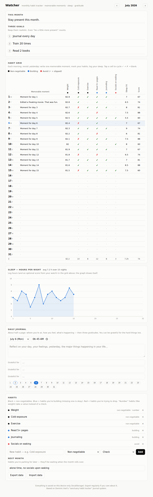

# Watcher

A monthly habit tracker that replicates Dominic Hart's "sanctuary habit
tracker" journal system from the video
[*"This book changed my life."*](https://youtu.be/QPrymYfmrCU) — as a
single-file web app, plus an Apple Notes template for the low-tech version.

## Why an app instead of Apple Notes?

The original request was an Apple Notes template. Notes can hold the goals,
memorable moments, and journal — but the two things that make this system work
are a **dense tappable habit grid** and a **plotted sleep graph**, and Apple
Notes has no charts and only rudimentary tables. So this repo ships both:

- **`index.html`** — Watcher, the full system in one file. No build step, no
  dependencies, no account. Data stays on your device (localStorage).
- **`apple-notes-template.md`** — a paste-ready Apple Notes template with setup
  instructions, for when you'd rather stay in Notes.

## What it does (the system from the video)

- **Monthly message + three goals** — a note to yourself and three realistic
  goals for the month.
- **Habit grid** — one row per day. Habits are color-coded the way Dominic
  does it: **black** = non-negotiables, **blue** = habits you're building
  (missing one is okay), **red** = habits you're trying to drop. Tap a cell to
  cycle ✓ → ✗ → blank. "Number" habits (like weight) take a value instead.
- **Memorable moments** — one line per day. Filled in each *morning* about
  *yesterday*, which is the core ritual of the system.
- **Sleep graph** — log hours (and your watch's sleep score) in the grid; the
  line graph draws itself, with hover details and a monthly average.
- **Daily journal** — about half a page, stamped with date and time, ending
  with three "grateful for" lines.
- **Next month** — a parking lot for habits you'll add later; carried forward
  when the month rolls over.
- **Monthly rollover** — a new month starts with your current habit list.
- **Export / import** — your data as JSON, so nothing is locked in.

Light and dark mode follow your system setting.

## How to use it

**Easiest:** open `index.html` in any browser. On iPhone, open it in Safari and
use **Share → Add to Home Screen** to get an app icon.

**Best:** host it with GitHub Pages (Settings → Pages → deploy from branch) so
you have a URL that works on all your devices. Note that data is stored
per-device/browser — use Export/Import to move it.

## The morning ritual

1. Wake up, weigh in, fill in today's number.
2. Revisit **yesterday**: one memorable moment, ✓/✗ each habit.
3. Log last night's sleep hours and score from your watch.
4. When you journal, keep it to half a page and end with three gratitudes —
   you can be grateful for the hard things too.

## Development

Everything lives in `index.html` (vanilla HTML/CSS/JS, no dependencies).
Screenshots in `docs/` are generated with Playwright.
