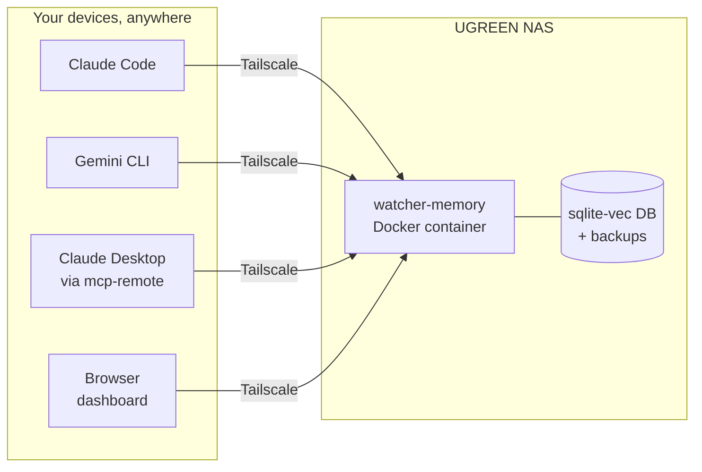

# Watcher Memory

Shared, persistent memory for all your AI assistants — Claude, Gemini, and
others — stored on your UGREEN NAS. Tell one assistant something on your
desktop, and every assistant on every device knows it.

No AI platform can share its internal memory with another. But they can all
connect to a memory service *you* own, via MCP (Model Context Protocol). This
repo is the deployment kit for that service:

- **Engine:** [mcp-memory-service](https://codeberg.org/doobidoo/mcp-memory-service)
  (open source), pinned to a known-good version — one Docker container on the NAS.
- **Search:** semantic (by meaning, not just keywords), using a small local
  embedding model. No API keys, no per-query cost, nothing leaves the NAS.
- **Network:** private [Tailscale](https://tailscale.com) mesh — your devices
  reach the NAS from anywhere; nothing is exposed to the internet.
- **Storage:** a SQLite database on the NAS, with scheduled backups.



## Quick start

**New here? Follow [SETUP.md](SETUP.md)** — the complete step-by-step
walkthrough from zero to working shared memory, with a checkpoint after every
part. The short version:

1. **NAS side** — install Tailscale, deploy the Docker Compose project:
   follow [docs/nas-setup.md](docs/nas-setup.md).
2. **Verify** — from any tailnet device:
   ```bash
   ./scripts/smoke-test.sh http://<nas-tailscale-ip>:8000 <your-api-key>
   ```
3. **Connect each AI client** — copy-paste configs in
   [docs/clients.md](docs/clients.md).
4. **Teach the agents the memory protocol** — one snippet in each client's
   instructions, from [docs/memory-conventions.md](docs/memory-conventions.md).

## What's in this repo

| Path | Purpose |
|---|---|
| `SETUP.md` | **Start here** — full step-by-step walkthrough |
| `docker-compose.yml` | The memory server (deploy on the NAS) |
| `.env.example` | Configuration template — copy to `.env`, set your API key |
| `docs/nas-setup.md` | UGREEN/UGOS setup: Tailscale, Docker, verify, harden |
| `docs/clients.md` | Per-client connection guides |
| `docs/memory-conventions.md` | Tagging scheme + the "memory protocol" prompt |
| `docs/phase2-public-exposure.md` | Future option: ChatGPT/claude.ai web access |
| `scripts/smoke-test.sh` | End-to-end health/store/search/delete check |
| `scripts/backup.sh` | On-demand backup + off-site copy |

## Which assistants can join?

| | |
|---|---|
| Claude Code, Gemini CLI | ✅ native |
| Claude Desktop | ✅ via a small bridge |
| ChatGPT, claude.ai (web) | ⏸ needs [phase 2](docs/phase2-public-exposure.md) (public exposure) |
| Kimi, DeepSeek | 📋 manual copy/paste via the web dashboard |
