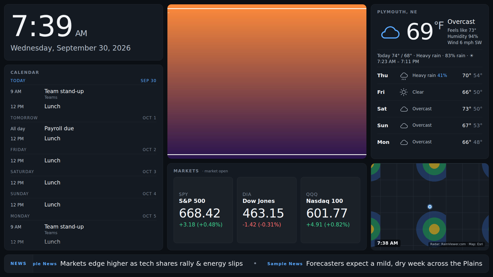

# Watcher Dashboard

A free, self-hosted replacement for a DAKboard-style wall display, built for a
Raspberry Pi 4B plugged into a TV or monitor. It shows:

- **Clock and date**
- **Current weather and a 5-day outlook** (Open-Meteo, no account needed)
- **Live animated radar** for the last two hours (RainViewer, no account needed)
- **Stocks** (Finnhub, free API key)
- **Your Outlook calendar** (the calendar's published ICS link, no Microsoft developer setup)
- **Photo slideshow** from a folder on the Pi
- **Scrolling news ticker** from RSS feeds (NPR, BBC, CBS by default)



Everything runs on the Pi. A small Python web server fetches the data on a
timer and serves one web page; Chromium shows that page full-screen at boot.
No subscriptions, no cloud account, and your calendar link and API key never
leave your home network.

---

## Part 1: Set up the Raspberry Pi (one time)

You need: a Raspberry Pi 4B (2 GB or more), a microSD card (16 GB+), a screen
with HDMI, and Wi-Fi or Ethernet.

1. On your computer, install **Raspberry Pi Imager** from
   <https://www.raspberrypi.com/software/>.
2. In Imager choose your Pi 4, then the OS **Raspberry Pi OS (64-bit)** (the
   normal one *with desktop*), then your SD card.
3. When Imager asks to customize settings, click **Edit settings** and set:
   - Hostname: `dashboard`
   - Username `pi` and a password you will remember
   - Your Wi-Fi name and password
   - Under **Services**, turn on **SSH** with password login
4. Write the card, put it in the Pi, connect the screen, and power it on. The
   first boot takes a couple of minutes.

You can do everything else from the Pi's own desktop (open **Terminal** from
the top menu) or from your computer over SSH:

```
ssh pi@dashboard.local
```

## Part 2: Install the dashboard

In the Pi's terminal, paste these lines one at a time:

```bash
sudo apt update && sudo apt full-upgrade -y
git clone https://github.com/schwadb/WatcherV1.git ~/WatcherV1
cd ~/WatcherV1/dashboard
bash deploy/install.sh
```

The install script takes about five minutes. It installs Chromium and the
Python packages, creates a `.env` file for your secrets, sets the Pi's time
zone, turns off screen blanking, and sets the dashboard to start on boot.

## Part 3: Add your two secrets

Two panels need something from you. Both go in the file
`~/WatcherV1/dashboard/.env`.

**Stocks: a free Finnhub API key**

1. Go to <https://finnhub.io/register> and create a free account.
2. Your API key is shown on the Finnhub dashboard page after you log in.
   Copy it.

**Calendar: your Outlook calendar's ICS link**

1. Open Outlook on the web (<https://outlook.office.com>) and click the gear
   icon (Settings).
2. Go to **Calendar** → **Shared calendars**.
3. Under **Publish a calendar**, pick the calendar, choose
   **Can view all details**, and click **Publish**.
4. Two links appear. Copy the **ICS** link (the one ending in `.ics`), not
   the HTML one.

If the Publish option is missing on a work account, your IT admin has turned
calendar publishing off. Ask them to allow it, or use a personal Outlook.com
calendar instead.

**Now put both values in the file:**

```bash
nano ~/WatcherV1/dashboard/.env
```

Paste each value after its `=` sign so the file looks like:

```
FINNHUB_API_KEY=abc123yourkeyhere
OUTLOOK_ICS_URL=https://outlook.office365.com/owa/calendar/.../calendar.ics
DASHBOARD_MOCK=0
```

Save with **Ctrl+O**, **Enter**, then exit with **Ctrl+X**. Then restart the
dashboard and check that every data source reports `"ok": true`:

```bash
sudo systemctl restart dashboard
sleep 20
curl http://localhost:8080/api/health
```

If a source says `"ok": false`, its `error` text tells you what to fix.

## Part 4: Add photos

Copy JPG or PNG photos into `~/WatcherV1/dashboard/photos/`. Any of these
work:

- **USB stick:** plug it into the Pi, then in the terminal
  `cp /media/pi/*/​*.jpg ~/WatcherV1/dashboard/photos/`
- **From a Mac or Linux computer:**
  `scp ~/Pictures/dash/*.jpg pi@dashboard.local:~/WatcherV1/dashboard/photos/`
- **From Windows:** use WinSCP or the Windows built-in `scp` in PowerShell
  with the same address.

New photos show up within five minutes (or right away after
`sudo systemctl restart dashboard`). The server makes a screen-sized copy of
each photo, so large phone photos are fine. iPhone **HEIC** files are not
supported: export them as JPEG first, or set the iPhone camera to
**Settings → Camera → Formats → Most Compatible**.

## Part 5: Reboot

```bash
sudo reboot
```

The Pi starts up, the dashboard server starts, and Chromium opens the page
full-screen. From any phone or laptop on the same Wi-Fi you can also open
<http://dashboard.local:8080> (or `http://<the Pi's IP>:8080`).

To get out of the full-screen browser on the Pi, plug in a keyboard and press
**Alt+F4**.

---

## Changing things

All the settings live in `~/WatcherV1/dashboard/config.yaml`. Open it with
`nano`, change what you like, then run `sudo systemctl restart dashboard`.
The screen picks the change up on its next refresh or at the nightly reload.

| Setting | What it does |
|---|---|
| `location` | City name, latitude/longitude and time zone for weather, radar and the clock |
| `units` | `imperial` (°F, mph) or `metric` (°C, km/h) |
| `clock_24h` | `true` for a 24-hour clock |
| `stocks.symbols` | Which tickers to show and their display names. Index symbols like `^GSPC` are not on Finnhub's free plan, so the defaults use the SPY, DIA and QQQ funds. |
| `news.feeds` | The RSS feeds for the ticker. Add any site's RSS address. |
| `calendar.days_ahead` | How many days of events to show |
| `photos.folder` | Where photos live (a full path like `/media/pi/PHOTOS` also works) |
| `photos.seconds_per_photo` | Slideshow speed |
| `radar.zoom` | 5 shows several states, 7 is the most detail the radar offers |
| `radar.provider` | `rainviewer` (default) or `mesonet` (US NEXRAD, a fallback if RainViewer changes) |
| `display.reload_at` | Time of the nightly browser reload |

## If something goes wrong

- **See what the server is doing:** `journalctl -u dashboard -f`
- **Check every data source:** `curl http://localhost:8080/api/health`
- **Force a refresh** (after adding photos, say): `curl -X POST http://localhost:8080/api/photos/refresh`
- **Black screen after boot on the Pi:** run
  `OZONE_PLATFORM=x11 ~/WatcherV1/dashboard/deploy/kiosk.sh` in a terminal.
  If that works, edit `~/.config/labwc/autostart` and add `OZONE_PLATFORM=x11`
  in front of the kiosk line.
- **Calendar shows "Busy" instead of event names:** re-publish the calendar
  with **Can view all details**.
- **Calendar changes take a while to appear:** Microsoft refreshes published
  calendar links on its own schedule, sometimes a few hours behind.
- **Test the page without internet or keys:** set `DASHBOARD_MOCK=1` in
  `.env`; every panel then shows sample data.

## Updating later

```bash
cd ~/WatcherV1 && git pull
cd dashboard && bash deploy/install.sh
```

## For developers

Plain Python 3.11 + FastAPI on the back end, vanilla HTML/CSS/JS on the front
end, no build step. Leaflet is vendored under `static/vendor/`.

```bash
python3 -m venv .venv && .venv/bin/pip install -r requirements.txt
.venv/bin/python tools/make_sample_photos.py        # three sample photos
DASHBOARD_MOCK=1 .venv/bin/uvicorn app.main:app --port 8080   # sample data, no network needed
bash tools/smoke.sh                                 # checks every /api/* endpoint
.venv/bin/python tools/check_calendar.py            # recurring-event parsing checks
node tools/screenshot.mjs http://127.0.0.1:8080 out.png   # needs Playwright for Node
```

Data sources and their terms: [Open-Meteo](https://open-meteo.com/) (free for
non-commercial use), [RainViewer](https://www.rainviewer.com/api.html) (free
for personal use, attribution shown on the map), [Finnhub](https://finnhub.io/)
(free tier), Esri World Dark Gray basemap tiles, and each news site's public
RSS feed.
